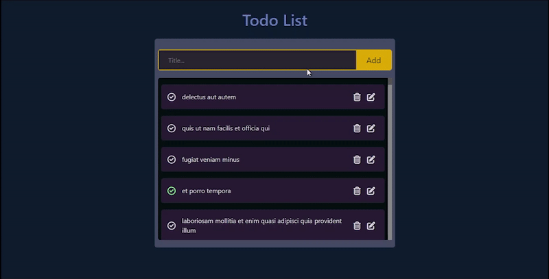

# Todo List

This Todo list is built using ReactJs and it is using [Jsonplacehoder](https://jsonplaceholder.typicode.com/todos) API to fetch todos, add new todo, delete a todo and update a todo. However, except for fetching the todos, the other three requests are dummy requests (not changing data on the server).

### Hosted link: [Todo List](https://rahul4019.github.io/TodoList-react/)



## Getting Started with the TodoList project

- Fork the project
- Clone the forked repository in your local system
- Run command to start the project

```bash
npm start
```

Runs the app in the development mode.\
Open [http://localhost:3000](http://localhost:3000) to view it in your browser.

## Functionality

- Add Todo
- Delete Todo
- Edit Todo

## Tools Used

- HTML
- CSS
- JavaScript
- Bootstrap
